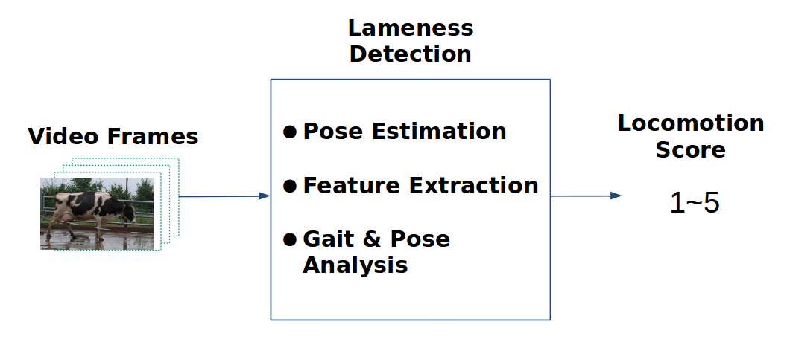

# Lameness-Detection
Lameness is a serious disorder in dairy farms that increases the risk of culling of cattle as well as economic losses. This issue is addressed by lameness detection using locomotion scoring, which assesses the lameness level of cattle by their pose and gait patterns. This project aims to evaluate the efficacy of deep neural networks in the context of automated locomotion scoring.

    

## Data Preparation
The raw data consist of 501 videos with a resolution of 1920 × 1080 at 50 frames per second (fps). Each video ranges from around four to twenty seconds long and contains a cow walking from left to right of the frame. These video were cropped in such a way that the cow is at the center of each frame, which also reduces the size of the data. The processed video clips have a resolution of 680×420 at 20 fps.

### Pose Estimation
This step estimates the pose of cows by extracting a few keypoints from their body. An open-source framework called [DeepLabCut](https://github.com/AlexEMG/DeepLabCut) is used for pose estimation. The whole process can be carried out by following the instructions in [DeepLabCut Demo](https://github.com/AlexEMG/DeepLabCut/blob/master/examples/Demo_yourowndata.ipynb).

## Training

### Approach1

### Approach2
