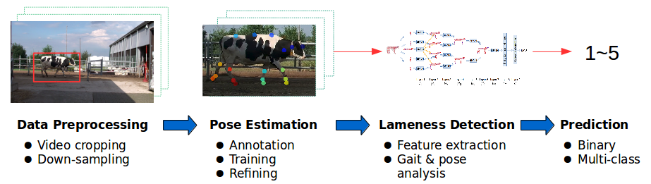

# Lameness-Detection
Lameness is a serious disorder in dairy farms that increases the risk of culling of cattle as well as economic losses. This issue is addressed by lameness detection using locomotion scoring, which assesses the lameness level of cattle by their pose and gait patterns. This project aims to evaluate the efficacy of deep neural networks in the context of automated locomotion scoring, with a comparison with other machine learning methods.

    

## Data preparation
The raw data were a series of videos with a resolution of 1920 × 1080 at 50 frames per second (fps). Each video ranges from around four to ten minutes long, containing several cows walking individually on a walkway. These videos were preprocessed to generate the skeleton sequences for lameness detection, as shown in the figure below. 

    

### Video preprocessing
The raw videos were first trimmed into 500 shorter video clips, each of which contains only one cow walking from left to right of the frame. The raw videos were cropped in such a way that the cow is at the center of each frame, which also reduces the size of the data. The processed video clips have a resolution of 680×420 at 20 fps.

### Pose estimation
This step estimates the pose of cows by extracting 25 keypoints (Figure shown below) from their body. An open-source framework called [DeepLabCut](https://github.com/AlexEMG/DeepLabCut) is used for pose estimation. The whole process can be carried out by following the instructions in [DeepLabCut Demo](https://github.com/AlexEMG/DeepLabCut/blob/master/examples/Demo_yourowndata.ipynb). The predicted poses genertaed by DeepLabCut toolbox were transformed into JavaScript Object Notation (JSON) from hierarchical data format (HDF) files to form the skeleton sequence dataset (frames of (x,y) coordinates of keypoints in pixels for each video).

    

## Approach
A hierarchical recurrent neural network ([HRNN](https://www.cv-foundation.org/openaccess/content_cvpr_2015/html/Du_Hierarchical_Recurrent_Neural_2015_CVPR_paper.html)) was adopted to train the skeleton data for lameness detection. Two other machine learning methods were used for comparison, namely the Random Forest and K-Clustering.

### Hierarchical Recurrent Neural Network ([HRNN](https://www.cv-foundation.org/openaccess/content_cvpr_2015/html/Du_Hierarchical_Recurrent_Neural_2015_CVPR_paper.html))
The network is based on the idea that actions are dependent on the movements of individual body parts and their combinations. The coordinates of the five body parts are fed into five subnets, and the representations of each part are hierarchically fused as the number of layers increases.

    

### Random Foreset
To apply the random forest, several features are selected: right/left step overlaps, strides, and back arch (radius from three keypoints on the back). These features are calculated from the skeleton data across the time sequence for each data sample (cow). 

    

### HRNN + Random Foreset
As the HRNN can automatically extract features from the skeleton sequences, these features can be used to train the random forest. 

### K-Means Clustering (Unsupervised Learning)
Given a specified number of centroids, k-means clustering allocates each data sample to one of the centroids based on the distance between the samples and the centroids. In this case, the paramter k is the number of classes. In order to assess the result, the manual scores are used to calculate the accuracy and F1-score from the clustered data.

## Result
This section summarizes the experimental results of HRNN, Rnadom Forest, and K-Clustering.

### HRNN and its variants
Inspired by the original paper of HRNN(https://www.cv-foundation.org/openaccess/content_cvpr_2015/html/Du_Hierarchical_Recurrent_Neural_2015_CVPR_paper.html), three variants are compared:

  * HBRNN: Heirarchically Bidirectional RNN
  * HURNN: Heirarchically unidirectional RNN
  * DBRNN: Deep Bidirectional RNN, in which stacked bidirectional RNN is trained with the whole skeleton as input

| Architecture  | Accuracy (%)  | F1 Score  |
|      :-:      |      :-:      |    :-:    |
|     HBRNN     |      74.6     |   0.583   |
|     HURNN     |      74.3     |   0.527   |
|     DBRNN     |      73.6     |   0.572   |

### HRNN and Random Forest
Rnadom forest was trained in two ways: one (RF) with five hand-crafted features, and the other (RF + HBRNN) with 80 features from the 7th layer of HBRNN. While hand-crafted features appear to be better than the automatic features from HBRNN in training random forest, the HBRNN still shows better performance in terms of both the accuracy and F1 score. 

|   Methods  |  Accuracy (%) | F1 Score  |
|    :-:     |      :-:      |    :-:    |
|    HBRNN   |      74.6     |   0.583   |
|     RF     |      69.6     |   0.574   |
| RF + HBRNN |      56.1     |   0.408   |

    

### K-Means Clustering
Two sets of features were used: skeleton sequence, and the five hand-crafted features as explained above. The multi-dimensional skeleton sequences are visualized using t-Distributed Stochastic Neighbor Embedding (t-SNE), a non-linear technique for dimensionality reduction, as shown below. There is no clear boundary between healthy and lame cows, which may explain the low accuracy. 

|   Features   |  Accuracy (%) | F1 Score  |
|      :-:     |      :-:      |    :-:    | 
|   skeleton   |      49.6     |   0.468   |
| hand-crafted |      42.5     |   0.526   |

    

## Discussion
After the analysis of results, the issues of this project are sumarized below:
1. Data: 
Both the data amount and quality play a significant role, but the two factors are correlated in this project. The skeleton sequences are used as input data as a way to encode the cow's gait and pose as prior knowledge to circumvent the issue of lack of data. However, the skeleton sequences are noisy, which has a great impact on lameness detection. 

2. Feature extraction:
Lameness detection requires long observation and careful investigation of a cow's movements. Lameness features are subtle; besides, any change of pose or locomotion does not necessarily imply lameness. With noisy skeleton data, it is extremely hard to distinguish between healthy and lame cows. As for hand-crafted features, the errors can be accumulated from the noisy skeleton sequences. The selected keypoints may have affected the process as well.

3. Method: 
The adoption of HRNN is based on the assumption that the features of each body part and their correlation are important to detect lameness. The method can be improved by including another stream of cow's whole body, such that the model can learn features not only from individual body parts but also from the whole appearance.

4. Unsupervised learning: 
The reason of applying unsupervised learning is to avoid the issue of incorrect manual labeling (locomotion scores).  Nonetheless, the manual scores were considered as the ground truth to assess the performance of the k-means clustering since there was no way to validate the manual scores. With a closer look into the clustering result, healthy and lame cows could not be correctly differentiated.

## Conclusions
The aim of this study was to assess the efficacy of deep neural networks (HRNN) and differnt machine learning methods in automated lameness detection. Without sufficient data, the skelton sequences are used as input data as a way to encode the cow's gait and pose as prior knowledgethe. Deep learning still showed promising result, although there is still room for improvement, e.g. data acquisition, feature selection, method.    
